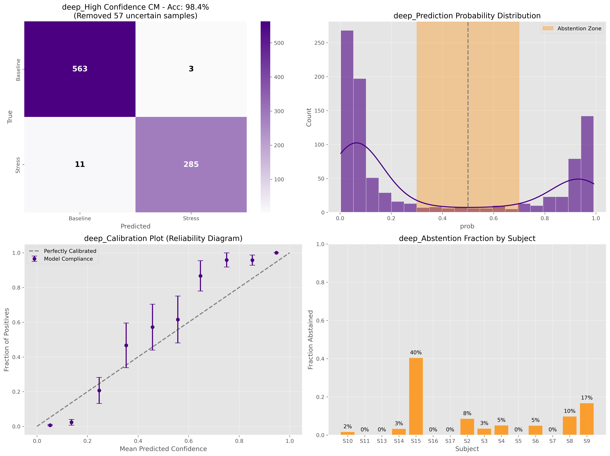

# Wearable Stress Biomarker & MLOps Pipeline


## Project Overview
This project implements an end-to-end Machine Learning pipeline to detect physiological stress from multi-modal wearable sensor data. Typically, physiological signal processing is confined to research notebooks; here, I demonstrate how to bridge the gap between biomedical research and production-ready MLOps engineering good practices.

The system processes raw biosignals (ECG, EDA, Respiration, Temperature, Accelerometry) to classify the user's state as **Baseline** or **Stress** in real-time.

**Use Case Scenario:**
*Consider an occupational safety system for high-stakes professions (e.g., pilots, first responders). The goal is to monitor physiological stress benchmarks in real-time, flagging cognitive overload before performance degrades or safety is compromised.*

**Key Engineering Value:**
1.  **Rigorous Validation**: Implements **Leave-One-Subject-Out (LOSO)** cross-validation. This ensures the model generalizes to *unseen* individuals, preventing the "identity leakage" common in amateur biomedical AI.
2.  **Deep Representation Learning**: A custom **ResNet-1D** with Squeeze-and-Excitation blocks learns morphological features directly from raw time-series, eliminating the need for brittle manual feature engineering.
3.  **Full MLOps Lifecycle**: Includes **CI/CD automation**, data versioning, Signal Quality Indices (SQI), Model Drift detection, and a FastAPI deployment endpoint.

Created by Giulio Matteucci in 2026.

> **Development Note**: The current pipeline is fully validated and tested on the **CHEST** sensor modality (High-fidelity ECG, Chest EDA). The infrastructure currently supports the **WRIST** modality (PPG/BVP), but specific validation benchmarks for wrist-based signals are currently in development.

## Dataset & Methodology
This project utilizes the **WESAD (Wearable Stress and Affect Detection)** dataset (N=15).
- **Signals**: ECG (700Hz), EDA, Respiration, Temperature, Accelerometer.
- **Preprocessing**: Signals are aligned, resampled to 35Hz, and segmented into 60s sliding windows.

### Deep Learning Architecture
We feed raw multi-channel signal tensors `(Batch, 7, 2100)` (ACC_x, ACC_y, ACC_z, ECG, EDA, RESP, TEMP) into a custom **ResNet-1D** with Squeeze-and-Excitation blocks. This validates that deep representation learning can outperform manual feature engineering (e.g., HRV stats) for this task.

## Engineering & MLOps Maturity
This project goes beyond simple model training by implementing a comprehensive MLOps framework to ensure code quality, reproducibility, and deployment readiness.

### 1. Continuous Integration & Deployment (CI/CD)
Automated pipelines via **GitHub Actions** ensure that every commit is vetted before merging.
- **CI Pipeline** (`ci.yaml`): runs on every push using Python 3.9.
  - **Code Quality**: Enforces strict linting and formatting via **Ruff**.
  - **Automated Testing**: Executes the full `pytest` suite (verified clean).
- **CD Pipeline**:
  - Automatically builds a Docker image on merges to `main`.
  - Tags the image with the commit SHA and pushes to **GitHub Container Registry**.

### 2. Quality Gates & Standards
- **Pre-commit Hooks**: Local quality control prevents "dirty" commits. Automatically fixes trailing whitespace, sorts imports, and checks for valid YAML/Python syntax before `git commit` is allowed.
- **Type Safety**: Critical paths are typed, and the project avoids "notebook-style" coding in the source directory.

### 3. Testing Strategy
A robust testing suite covers both software functionality and scientific correctness:
- **Unit Tests**: Verify data loaders and utility functions.
- **Integration Tests**: Ensure the `train` -> `evaluate` -> `inference` pipeline flows correctly.
- **Scientific Validation**: `test_feature_correctness.py` validates that signal processing logic (e.g., peak detection) matches physiological ground truth.
- **API Smoke Tests**: Verifies the FastAPI inference endpoint launches and handles requests correctly.

### 4. Containerization
The application is fully Dockerized for "Write Once, Run Anywhere" deployment.
- **Optimized Build**: `.dockerignore` excludes massive raw data and experimental reports, resulting in a lean production image.
- **Immutable Artifacts**: The production model is baked into `models/prod/` inside the container, ensuring the deployed service behaves exactly as validated.

### 5. Runtime Guardrails & Monitoring
Reliability in production requires more than just high accuracy; it requires awareness of data health.
- **Signal Quality Index (SQI) Protocol**: Before inference, every 60s window passes through an SQI gate. Windows with "Dead" signals (flatline temperature) or excessive noise (high-g accelerometer variance) are rejected immediately, protecting the model from garbage inputs.
- **Drift Detection**: The system implements Kolmogorov-Smirnov (KS) tests (`src/monitoring`) to statistically compare incoming inference batches against the training baseline, enabling early detection of Feature Drift (e.g., sensor degradation).

## How to Run

### Installation
```bash
# Clone the repo
git clone https://github.com/gmatteuc/Wearable_stress_biomarker.git
cd Wearable_stress_biomarker

# Install environment
conda env create -f environment.yml
conda activate wearable_stress

# Install project in editable mode
pip install -e .
```

### Running Tests
```bash
# Run the full test suite
pytest tests/
```

### Running the API (Docker)
```bash
# Build the image locally
docker build -t wearable-stress-api .

# Run the container (Port 8000)
docker run -p 8000:8000 wearable-stress-api
```
The API documentation will be available at `http://localhost:8000/docs`.

### Running the Analysis (Reproduction)
To reproduce the training and evaluation:
```bash
# 1. Process Raw Data
python src/data/make_dataset.py

# 2. Train Deep Learning Model (LOSO Validation)
python src/models/train.py --model deep
```

## Modeling Results
The included `models/prod` artifact achieves:
- **Accuracy**: ~96.1% (Binary Classification: Baseline vs Stress)
- **F1-Score**: ~0.95 (Macro Avg)
- **Inference Latency**: <50ms per 60s window on CPU (Trained on GPU).
- **Deep Learning (ResNet-1D)**: A 4-stage 1D-CNN with Squeeze-and-Excitation blocks.

## Key Findings & Performance

The Deep Learning approach demonstrates **superior performance** and robustness compared to the classical baseline.

| Metric | Baseline (Logistic) | Deep Model (ResNet-1D) |
| :--- | :---: | :---: |
| **Accuracy** | ~86% | **~96%** |
| **ROC AUC** | 0.89 | **0.99** |
| **Inference Time** | <1ms | ~15ms |

### Diagnostic Audit
The Confusion Matrix below confirms that the model is highly effective at distinguishing **Stress** (Class 1) from **Baseline** (Class 0), with minimal False Negatives (crucial for a safety monitoring system).

<div align="center">
  
  <p><em>Global Performance Panel: The near-perfect ROC curve (Top Right) and diagonal Confusion Matrix (Left) validate the model's discriminative power using rigorous LOSO cross-validation.</em></p>
</div>

### Reliability & Explainability
High accuracy is not enough for deployment; we must know *when* the model is unsure. We implemented a confidence-based abstention mechanism.

<div align="center">
  
  <p><em>Reliability Audit: The histogram (top right) shows the model pushes most predictions to high confidence (0.9-1.0), indicating decisive classification.</em></p>
</div>


## 💻 Project Structure
```
├── configs/            # YAML configuration for experiments
├── data/               # Data management (Raw vs Processed)
├── notebooks/          # Verification & Demo Notebooks
│   ├── 01_preprocessing.ipynb
│   ├── 04_deep_learning_verification.ipynb
│   └── 05_inference_demo.ipynb
├── reports/            # Training artifacts (Models, Logs, Plots)
├── src/
│   ├── api/            # FastAPI deployment
│   ├── data/           # ETL & Validation logic
│   ├── features/       # SQI & Feature Extraction
│   ├── models/         # PyTorch (ResNet) & Scikit-Learn logic
│   └── monitoring/     # Drift detection modules
├── Dockerfile          # Container definition
├── Makefile            # Automation
└── README.md           # Documentation
```

## ⚙️ Installation & Usage

1. **Environment Setup**:
   The project provides a Makefile for comprehensive setup, or a standard Conda environment file.
   ```bash
   make setup
   ```
   *Alternatively (Conda)*:
   ```bash
   conda env create -f environment.yml
   conda activate wearable_stress
   ```

2. **Data Pipeline**:
   Download and process the raw WESAD data (assumes WESAD.zip is in `data/raw`).
   ```bash
   make preprocess
   ```

3. **Train Models**:
   Execute the full training pipeline (Baseline + Deep):
   ```bash
   make train-baseline
   make train-deep
   ```

4. **Run API**:
   Launch the inference server locally.
   ```bash
   make run-api
   ```

## Dependencies
- **Core**: `pandas`, `numpy`, `scipy`
- **Deep Learning**: `torch` (Custom 1D ResNet implementation)
- **ML**: `scikit-learn`, `joblib`
- **Deployment**: `fastapi`, `uvicorn`, `docker`
