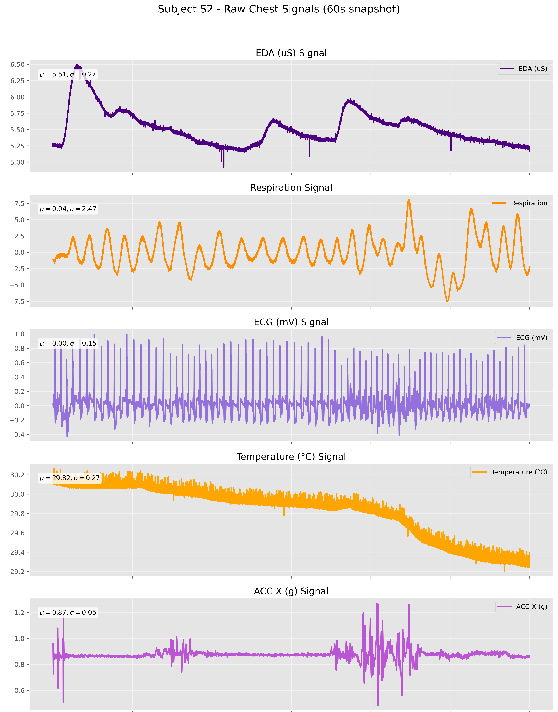
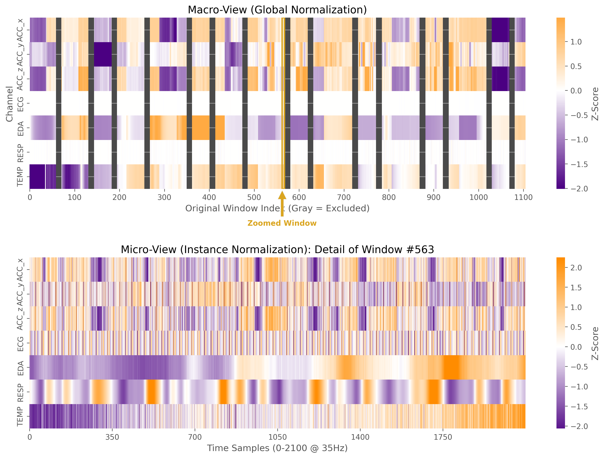

# Wearable Stress Biomarker & MLOps Pipeline


## Project Overview
This project implements an end-to-end "Engineering Grade" Machine Learning pipeline to detect physiological stress from multi-modal wearable sensor data. Typically, physiological signal processing is confined to research notebooks; here, I demonstrate how to bridge the gap between biomedical research and production-ready MLOps.

The system processes raw biosignals (ECG, EDA, Respiration, Temperature, Accelerometry) to classify the user's state as **Baseline** or **Stress** in real-time.

**Use Case Scenario:**
*Consider an occupational safety system for high-stakes professions (e.g., pilots, first responders). The goal is to monitor physiological stress benchmarks in real-time, flagging cognitive overload before performance degrades or safety `is compromised. This requires not just high accuracy, but robust generalization to new users and explainable reliability metrics.*

**Key Engineering Value:**
1.  **Rigorous Validation**: Implements **Leave-One-Subject-Out (LOSO)** cross-validation. This ensures the model generalizes to *unseen* individuals, preventing the "identity leakage" common in amateur biomedical AI.
2.  **Deep Representation Learning**: A custom **ResNet-1D** with Squeeze-and-Excitation blocks learns morphological features directly from raw time-series, eliminating the need for brittle manual feature engineering.
3.  **Full MLOps Lifecycle**: Includes data versioning, Signal Quality Indices (SQI), Model Drift detection, and a FastAPI deployment endpoint.

Created by Giulio Matteucci in 2026.

> **Development Note**: The current pipeline is fully validated and tested on the **CHEST** sensor modality (High-fidelity ECG, Chest EDA). The infrastructure currently supports the **WRIST** modality (PPG/BVP), but specific validation benchmarks for wrist-based signals are currently in development.

## Dataset
The project utilizes the **WESAD (Wearable Stress and Affect Detection)** dataset (N=15).
- **Signals Used**: ECG (700Hz), EDA, Respiration, Temperature, Accelerometer (3-axis).
- **Preprocessing**: All signals are resampled to 35Hz, aligned, and segmented into 60s sliding windows with 50% overlap.

## Methodology

### 1. From Raw Signals to Deep Features
Instead of manually calculating 100+ statistical features (mean, HRV, peak-counts), we feed the raw multi-channel signal tensor `(Batch, 7, 2100)` into a Deep Residual Network.

<div align="center">
  
  <p><em>Raw 60s Input Window (noisy, multi-modal).</em></p>
  <br>
  
  <p><em>Visualization of the Multi-scale Normalized Tensor inputs (what the network sees).</em></p>
</div>
<br>

* **Top**: Raw multi-channel signals (ECG, EDA, Resp) prior to normalization.
* **Bottom**: The **Normalized Input Tensor** fed to the CNN. The top half shows Global Normalization (preserving signal magnitude), while the bottom half shows Instance Normalization (highlighting local shape morphology).

### 2. Machine Learning Modeling
Two modeling approaches were compared to establish a robust benchmark:
- **Baseline (Classical ML)**: Logistic Regression on statistically engineered features.
- **Deep Learning (ResNet-1D)**: A 4-stage 1D-CNN with Squeeze-and-Excitation blocks.

## Key Findings & Performance

The Deep Learning approach demonstrates **superior performance** and robustness compared to the classical baseline.

| Metric | Baseline (Logistic) | Deep Model (ResNet-1D) |
| :--- | :---: | :---: |
| **Accuracy** | ~86% | **~96%** |
| **ROC AUC** | 0.90 | **0.99** |
| **Inference Time** | <1ms | ~15ms |

### Diagnostic Audit
The Confusion Matrix below confirms that the model is highly effective at distinguishing **Stress** (Class 1) from **Baseline** (Class 0), with minimal False Negatives—crucial for a safety monitoring system.

<div align="center">
  
  <p><em>Global Performance Panel: The near-perfect ROC curve (Top Right) and diagonal Confusion Matrix (Left) validate the model's discriminative power using rigorous LOSO cross-validation.</em></p>
</div>

### Reliability & Explainability
High accuracy is not enough for deployment; we must know *when* the model is unsure. We implemented a confidence-based abstention mechanism.

<div align="center">
  
  <p><em>Reliability Audit: The histogram (top right) shows the model pushes most predictions to high confidence (0.9-1.0), indicating decisive classification.</em></p>
</div>


## 💻 Project Structure
```
├── configs/            # YAML configuration for experiments
├── data/               # Data management (Raw vs Processed)
├── notebooks/          # Verification & Demo Notebooks
│   ├── 01_preprocessing.ipynb
│   ├── 04_deep_learning_verification.ipynb
│   └── 05_inference_demo.ipynb
├── reports/            # Training artifacts (Models, Logs, Plots)
├── src/
│   ├── api/            # FastAPI deployment
│   ├── data/           # ETL & Validation logic
│   ├── features/       # SQI & Feature Extraction
│   ├── models/         # PyTorch (ResNet) & Scikit-Learn logic
│   └── monitoring/     # Drift detection modules
├── Dockerfile          # Container definition
├── Makefile            # Automation
└── README.md           # Documentation
```

## ⚙️ Installation & Usage

1. **Environment Setup**:
   The project uses `conda` and `pip` via a Makefile for reproducible setup.
   ```bash
   make setup
   ```

2. **Data Pipeline**:
   Download and process the raw WESAD data (assumes WESAD.zip is in `data/raw`).
   ```bash
   make preprocess 
   ```

3. **Train Models**:
   Execute the full training pipeline (Baseline + Deep):
   ```bash
   make train-baseline
   make train-deep
   ```

4. **Run API**:
   Launch the inference server locally.
   ```bash
   make run-api
   ```

## Dependencies
- **Core**: `pandas`, `numpy`, `scipy`
- **Deep Learning**: `torch`, `torchvision` (1D ResNet adaptation)
- **ML**: `scikit-learn`, `joblib`
- **Deployment**: `fastapi`, `uvicorn`, `docker`
